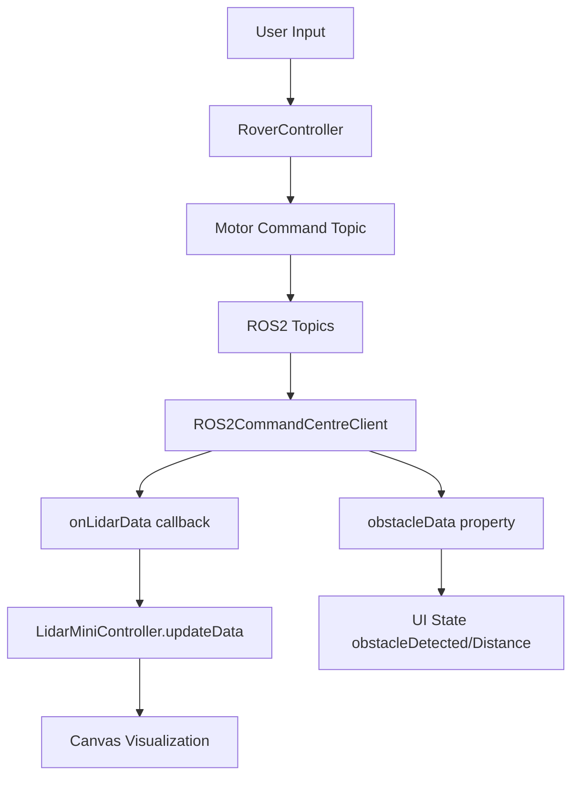

# Manual Control Page Refactoring Summary

## Overview
The manual control page has been refactored to use the centralized `ROS2CommandCentreClient` for all sensor data (lidar, obstacle detection) while keeping motor command publishing separate.

## Changes Made

### 1. `manualControl.ts` - Simplified Controller

#### Removed:
- ❌ `LidarData` interface (now imported from `$lib/ros2CommandCentre`)
- ❌ Lidar-related config (`lidarTopic`, `obstacleDetectedTopic`, `obstacleDistanceTopic`, `gpsTopic`)
- ❌ Lidar visualization properties (`_lidarCanvas`, `_lidarContext`, `_lidarData`)
- ❌ Obstacle detection state (`_obstacleDetected`, `_obstacleDistance`)
- ❌ Lidar handler (`_lidarHandler`)
- ❌ `initLidarVisualization()` method
- ❌ `resizeLidarCanvas()` method  
- ❌ `visualizeLidarData()` method
- ❌ `setLidarHandler()` method
- ❌ Lidar subscription in `connectToRover()`
- ❌ Obstacle detection subscriptions
- ❌ Message handling for lidar/obstacle topics
- ❌ Topic unsubscribe logic in `disconnectFromRover()`
- ❌ `obstacleDetected` and `obstacleDistance` getters

#### Kept:
- ✅ Motor command publishing logic
- ✅ WebRTC video stream connection
- ✅ Movement methods (`moveForward()`, `moveBackward()`, etc.)
- ✅ Keyboard/button handling
- ✅ Connection status management
- ✅ Logging functionality

### 2. `+page.svelte` - Updated Integration

#### Added:
- ✅ Import `createMiniLidar` and `LidarMiniController`
- ✅ Import `commandCenterManager` and `ROS2CommandCentreClient`
- ✅ `lidarController` state variable
- ✅ `commandCenterClient` state variable
- ✅ `roverId` from page params
- ✅ Connection to Command Center in `onMount`
- ✅ Lidar data subscription via `onLidarData()` callback
- ✅ Obstacle data polling from Command Center
- ✅ Cleanup of Command Center client in `onDestroy`

#### Removed:
- ❌ Obstacle detection state from controller reactive statements
- ❌ `initLidarVisualization()` call

#### Updated:
- ✅ Obstacle detection now uses local state updated from Command Center
- ✅ Lidar visualization handled by `LidarMiniController`

## Architecture

### Before:
```
Manual Control Page
├── RoverController
│   ├── ROS WebSocket (motor commands + lidar + obstacles)
│   ├── Lidar visualization
│   └── Obstacle detection
└── WebRTC (video)
```

### After:
```
Manual Control Page
├── RoverController
│   ├── ROS WebSocket (motor commands only)
│   └── WebRTC (video)
├── ROS2CommandCentreClient (via commandCenterManager)
│   ├── Lidar subscription
│   ├── Obstacle detection
│   └── All other sensor data
└── LidarMiniController (visualization only)
    └── Receives data from ROS2CommandCentreClient
```

## Benefits

### 1. **Single Source of Truth**
- All sensor data flows through `ROS2CommandCentreClient`
- No duplicate subscriptions across pages
- Consistent data across the application

### 2. **Separation of Concerns**
- `RoverController` handles motor commands only
- `ROS2CommandCentreClient` handles all sensor data
- `LidarMiniController` handles visualization only

### 3. **Maintainability**
- Easier to debug (one place for sensor data)
- Easier to add new sensors (just add to Command Center)
- Less code duplication

### 4. **Performance**
- No redundant WebSocket connections
- Efficient data sharing between components
- Centralized connection management

## Data Flow



## Testing Checklist

- [ ] Lidar visualization appears correctly
- [ ] Obstacle detection updates in real-time
- [ ] Motor commands work (forward, backward, left, right, stop)
- [ ] Keyboard controls work (WASD, arrow keys)
- [ ] Video stream displays correctly
- [ ] No duplicate lidar subscriptions (check ROS bridge logs)
- [ ] Connection status updates properly
- [ ] Clean disconnection when leaving page
- [ ] No console errors

## Future Improvements

1. **Command Publishing**: Consider moving motor commands to Command Center too for consistency
2. **WebRTC**: Could also centralize WebRTC through Command Center
3. **State Management**: Use Svelte stores for sharing state between pages
4. **Error Handling**: Add retry logic for failed connections
5. **Loading States**: Add loading indicators for sensor data

## Related Files

- `/src/lib/ros2CommandCentre.ts` - Centralized ROS2 connection manager
- `/src/routes/rovers/[id]/lidarController.ts` - Reusable lidar visualization
- `/src/routes/manual-ctrl/[id]/manualControl.ts` - Motor command controller
- `/src/routes/manual-ctrl/[id]/+page.svelte` - Manual control UI
- `/LIDAR_INTEGRATION.md` - General lidar integration documentation
